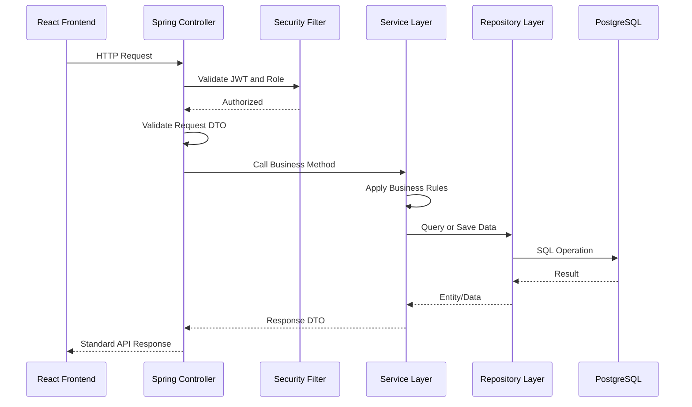

# Backend Request Flow

```mermaid
sequenceDiagram
    participant UI as React Frontend
    participant API as Spring Controller
    participant SEC as Security Filter
    participant SVC as Service Layer
    participant REPO as Repository Layer
    participant DB as PostgreSQL

    UI->>API: HTTP Request
    API->>SEC: Validate JWT and Role
    SEC-->>API: Authorized
    API->>API: Validate Request DTO
    API->>SVC: Call Business Method
    SVC->>SVC: Apply Business Rules
    SVC->>REPO: Query or Save Data
    REPO->>DB: SQL Operation
    DB-->>REPO: Result
    REPO-->>SVC: Entity/Data
    SVC-->>API: Response DTO
    API-->>UI: Standard API Response
```
