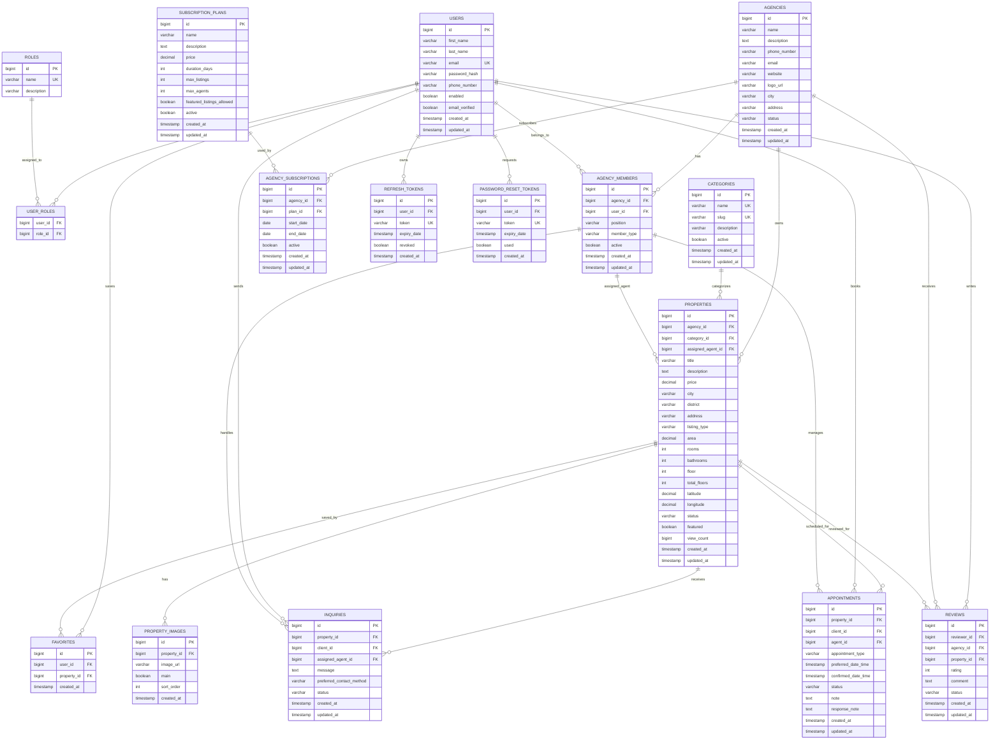

## EstateFlow Database ERD

```mermaid
erDiagram

    USERS {
        bigint id PK
        varchar first_name
        varchar last_name
        varchar email UK
        varchar password_hash
        varchar phone_number
        boolean enabled
        boolean email_verified
        timestamp created_at
        timestamp updated_at
    }

    ROLES {
        bigint id PK
        varchar name UK
        varchar description
    }

    USER_ROLES {
        bigint user_id FK
        bigint role_id FK
    }

    AGENCIES {
        bigint id PK
        varchar name
        text description
        varchar phone_number
        varchar email
        varchar website
        varchar logo_url
        varchar city
        varchar address
        varchar status
        timestamp created_at
        timestamp updated_at
    }

    AGENCY_MEMBERS {
        bigint id PK
        bigint agency_id FK
        bigint user_id FK
        varchar position
        varchar member_type
        boolean active
        timestamp created_at
        timestamp updated_at
    }

    CATEGORIES {
        bigint id PK
        varchar name UK
        varchar slug UK
        varchar description
        boolean active
        timestamp created_at
        timestamp updated_at
    }

    PROPERTIES {
        bigint id PK
        bigint agency_id FK
        bigint category_id FK
        bigint assigned_agent_id FK
        varchar title
        text description
        decimal price
        varchar city
        varchar district
        varchar address
        varchar listing_type
        decimal area
        int rooms
        int bathrooms
        int floor
        int total_floors
        decimal latitude
        decimal longitude
        varchar status
        boolean featured
        bigint view_count
        timestamp created_at
        timestamp updated_at
    }

    PROPERTY_IMAGES {
        bigint id PK
        bigint property_id FK
        varchar image_url
        boolean main
        int sort_order
        timestamp created_at
    }

    FAVORITES {
        bigint id PK
        bigint user_id FK
        bigint property_id FK
        timestamp created_at
    }

    INQUIRIES {
        bigint id PK
        bigint property_id FK
        bigint client_id FK
        bigint assigned_agent_id FK
        text message
        varchar preferred_contact_method
        varchar status
        timestamp created_at
        timestamp updated_at
    }

    APPOINTMENTS {
        bigint id PK
        bigint property_id FK
        bigint client_id FK
        bigint agent_id FK
        varchar appointment_type
        timestamp preferred_date_time
        timestamp confirmed_date_time
        varchar status
        text note
        text response_note
        timestamp created_at
        timestamp updated_at
    }

    REVIEWS {
        bigint id PK
        bigint reviewer_id FK
        bigint agency_id FK
        bigint property_id FK
        int rating
        text comment
        varchar status
        timestamp created_at
        timestamp updated_at
    }

    SUBSCRIPTION_PLANS {
        bigint id PK
        varchar name
        text description
        decimal price
        int duration_days
        int max_listings
        int max_agents
        boolean featured_listings_allowed
        boolean active
        timestamp created_at
        timestamp updated_at
    }

    AGENCY_SUBSCRIPTIONS {
        bigint id PK
        bigint agency_id FK
        bigint plan_id FK
        date start_date
        date end_date
        boolean active
        timestamp created_at
        timestamp updated_at
    }

    REFRESH_TOKENS {
        bigint id PK
        bigint user_id FK
        varchar token UK
        timestamp expiry_date
        boolean revoked
        timestamp created_at
    }

    PASSWORD_RESET_TOKENS {
        bigint id PK
        bigint user_id FK
        varchar token UK
        timestamp expiry_date
        boolean used
        timestamp created_at
    }

    USERS ||--o{ USER_ROLES : has
    ROLES ||--o{ USER_ROLES : assigned_to

    AGENCIES ||--o{ AGENCY_MEMBERS : has
    USERS ||--o{ AGENCY_MEMBERS : belongs_to

    AGENCIES ||--o{ PROPERTIES : owns
    CATEGORIES ||--o{ PROPERTIES : categorizes
    AGENCY_MEMBERS ||--o{ PROPERTIES : assigned_agent

    PROPERTIES ||--o{ PROPERTY_IMAGES : has
    USERS ||--o{ FAVORITES : saves
    PROPERTIES ||--o{ FAVORITES : saved_by

    PROPERTIES ||--o{ INQUIRIES : receives
    USERS ||--o{ INQUIRIES : sends
    AGENCY_MEMBERS ||--o{ INQUIRIES : handles

    PROPERTIES ||--o{ APPOINTMENTS : scheduled_for
    USERS ||--o{ APPOINTMENTS : books
    AGENCY_MEMBERS ||--o{ APPOINTMENTS : manages

    USERS ||--o{ REVIEWS : writes
    AGENCIES ||--o{ REVIEWS : receives
    PROPERTIES ||--o{ REVIEWS : reviewed_for

    AGENCIES ||--o{ AGENCY_SUBSCRIPTIONS : subscribes
    SUBSCRIPTION_PLANS ||--o{ AGENCY_SUBSCRIPTIONS : used_by

    USERS ||--o{ REFRESH_TOKENS : owns
    USERS ||--o{ PASSWORD_RESET_TOKENS : requests
```
