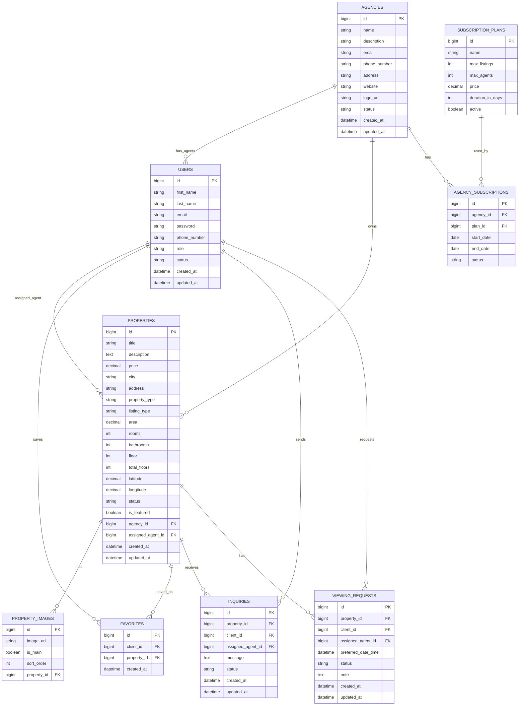

# Database ERD

```mermaid
erDiagram
    USERS {
        bigint id PK
        string first_name
        string last_name
        string email
        string password
        string phone_number
        string role
        string status
        datetime created_at
        datetime updated_at
    }

    AGENCIES {
        bigint id PK
        string name
        string description
        string email
        string phone_number
        string address
        string website
        string logo_url
        string status
        datetime created_at
        datetime updated_at
    }

    PROPERTIES {
        bigint id PK
        string title
        text description
        decimal price
        string city
        string address
        string property_type
        string listing_type
        decimal area
        int rooms
        int bathrooms
        int floor
        int total_floors
        decimal latitude
        decimal longitude
        string status
        boolean is_featured
        bigint agency_id FK
        bigint assigned_agent_id FK
        datetime created_at
        datetime updated_at
    }

    PROPERTY_IMAGES {
        bigint id PK
        string image_url
        boolean is_main
        int sort_order
        bigint property_id FK
    }

    FAVORITES {
        bigint id PK
        bigint client_id FK
        bigint property_id FK
        datetime created_at
    }

    INQUIRIES {
        bigint id PK
        bigint property_id FK
        bigint client_id FK
        bigint assigned_agent_id FK
        text message
        string status
        datetime created_at
        datetime updated_at
    }

    VIEWING_REQUESTS {
        bigint id PK
        bigint property_id FK
        bigint client_id FK
        bigint assigned_agent_id FK
        datetime preferred_date_time
        string status
        text note
        datetime created_at
        datetime updated_at
    }

    SUBSCRIPTION_PLANS {
        bigint id PK
        string name
        int max_listings
        int max_agents
        decimal price
        int duration_in_days
        boolean active
    }

    AGENCY_SUBSCRIPTIONS {
        bigint id PK
        bigint agency_id FK
        bigint plan_id FK
        date start_date
        date end_date
        string status
    }

    AGENCIES ||--o{ USERS : has_agents
    AGENCIES ||--o{ PROPERTIES : owns
    USERS ||--o{ PROPERTIES : assigned_agent
    PROPERTIES ||--o{ PROPERTY_IMAGES : has
    USERS ||--o{ FAVORITES : saves
    PROPERTIES ||--o{ FAVORITES : saved_as
    USERS ||--o{ INQUIRIES : sends
    PROPERTIES ||--o{ INQUIRIES : receives
    USERS ||--o{ VIEWING_REQUESTS : requests
    PROPERTIES ||--o{ VIEWING_REQUESTS : has
    AGENCIES ||--o{ AGENCY_SUBSCRIPTIONS : has
    SUBSCRIPTION_PLANS ||--o{ AGENCY_SUBSCRIPTIONS : used_by
```
