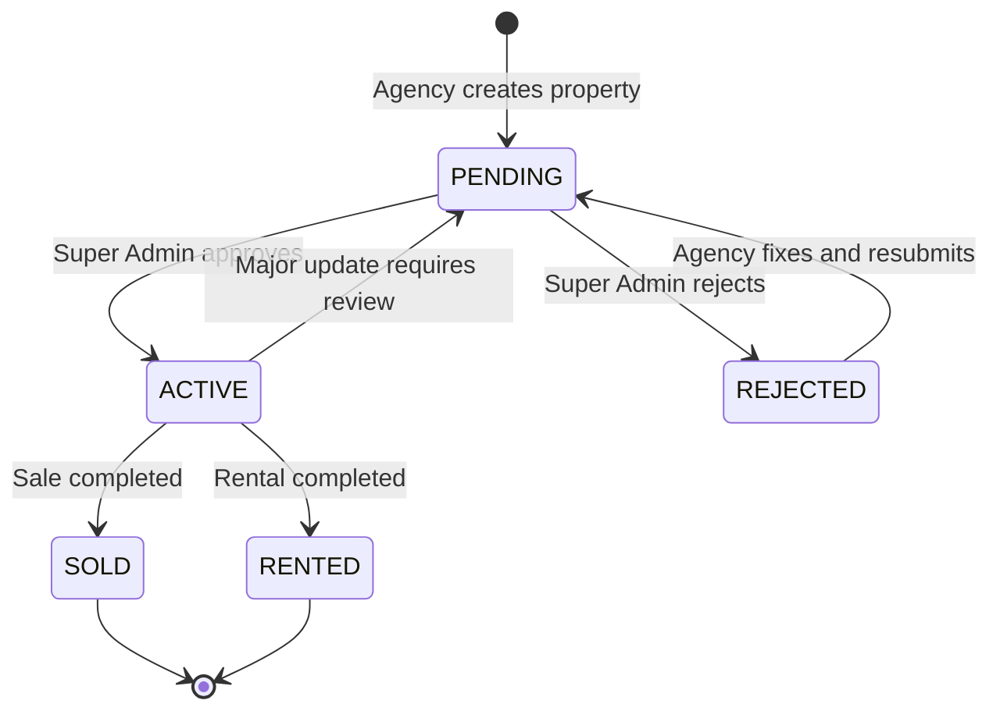

# Property Lifecycle Diagram

```mermaid
stateDiagram-v2
    [*] --> PENDING: Agency creates property
    PENDING --> ACTIVE: Super Admin approves
    PENDING --> REJECTED: Super Admin rejects
    ACTIVE --> SOLD: Sale completed
    ACTIVE --> RENTED: Rental completed
    ACTIVE --> PENDING: Major update requires review
    REJECTED --> PENDING: Agency fixes and resubmits
    SOLD --> [*]
    RENTED --> [*]
```
