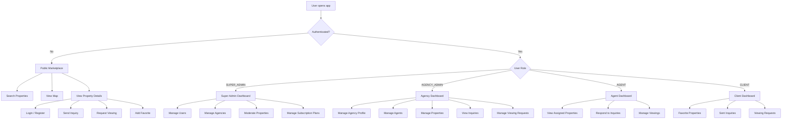

# Role and App Flow

```mermaid
flowchart TD
    A[User opens app] --> B{Authenticated?}
    B -- No --> C[Public Marketplace]
    C --> C1[Search Properties]
    C --> C2[View Map]
    C --> C3[View Property Details]
    C3 --> D[Login / Register]

    B -- Yes --> E{User Role}

    E -- SUPER_ADMIN --> SA[Super Admin Dashboard]
    SA --> SA1[Manage Users]
    SA --> SA2[Manage Agencies]
    SA --> SA3[Moderate Properties]
    SA --> SA4[Manage Subscription Plans]

    E -- AGENCY_ADMIN --> AA[Agency Dashboard]
    AA --> AA1[Manage Agency Profile]
    AA --> AA2[Manage Agents]
    AA --> AA3[Manage Properties]
    AA --> AA4[View Inquiries]
    AA --> AA5[Manage Viewing Requests]

    E -- AGENT --> AG[Agent Dashboard]
    AG --> AG1[View Assigned Properties]
    AG --> AG2[Respond to Inquiries]
    AG --> AG3[Manage Viewings]

    E -- CLIENT --> CL[Client Dashboard]
    CL --> CL1[Favorite Properties]
    CL --> CL2[Sent Inquiries]
    CL --> CL3[Viewing Requests]

    C3 --> F[Send Inquiry]
    C3 --> G[Request Viewing]
    C3 --> H[Add Favorite]
```
